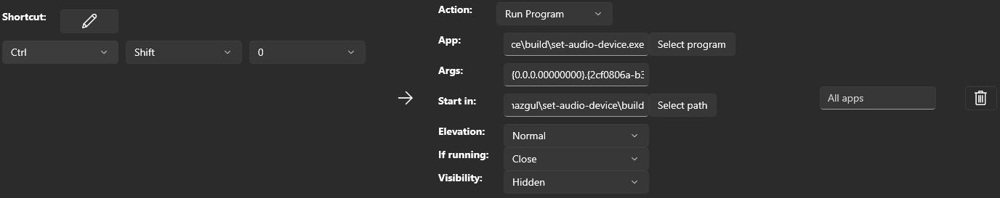

# Set audio device

Console application that can set the system audio device

Mostly to be used together with [PowerToys](https://learn.microsoft.com/en-us/windows/powertoys/).

## List active audio devices

Starting the app without any arguments will list the available active audio devices:


## Set device

The app accepts only one argument - device id (see above to get the list of the available devices and their ids)

```shell
.\set-audio-device.exe "{0.0.0.00000000}.{xxxxxxxx-xxxx-xxxx-xxxx-xxxxxxxxxxxx}"
```

(No confirmations are given. If the provided ID do not exists the ... nothing is going to happen)

## Print current device

Just to print the current active audio device

```shell
.\set-audio-device.exe current
```

## PowerToys

- start `PowerToys`
- choose `Keyboard Manager`
- scroll to `Remap a shortcut` and click on it
- press `+ Add shortcut remapping` (bottom left)
- choose the desired shortcut from the left side
- on the right side:

  - `Action` - `Run program`
  - `App` - the full path to `set-audio-device.exe`
  - `Args` - single device ID here. In format `{0.0.0.00000000}.{xxxxxxxx-xxxx-xxxx-xxxx-xxxxxxxxxxxx}`
  - `Start in` - (not sure its needed but ...) the folder where `set-audio-device.exe` is located
  - `Elevation` - `Normal`
  - `If running` - `Close`
  - `Visibility` - `Hidden`

    

  - press `OK`

You can setup as many of these shortcuts as you want.
